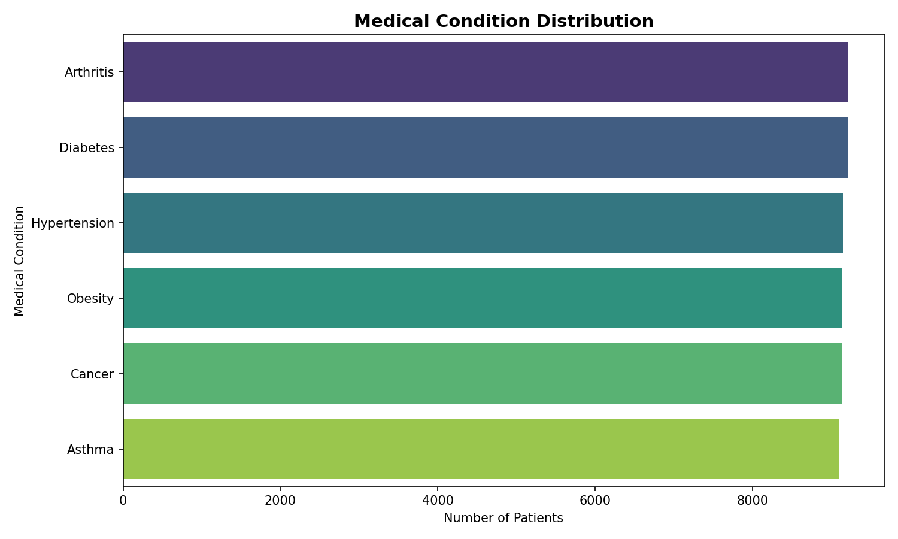
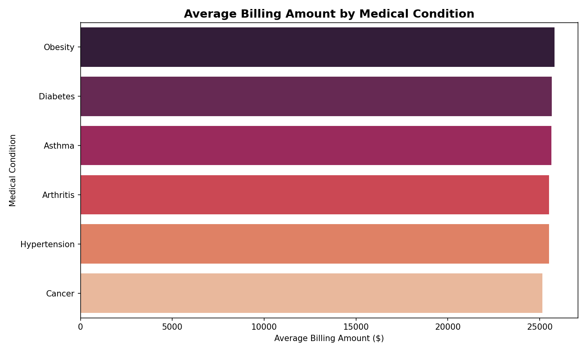

# 🏥 Healthcare Analytics Dashboard — End-to-End Data Pipeline

An end-to-end data analytics project that takes a raw healthcare dataset from **Kaggle**, cleans and transforms it in **Python**, analyzes it using **SQL (MySQL Workbench)**, and visualizes the insights through an **interactive 3-page Power BI dashboard** with AI-powered features.


---

## 📌 Project Overview

This project simulates a real-world healthcare analytics workflow — from raw, messy data to a decision-ready executive dashboard. The goal was to demonstrate the **complete data analyst pipeline**: data cleaning → SQL querying → BI visualization → AI-assisted insights.

**Dataset:** [Healthcare Dataset – Kaggle](https://www.kaggle.com/datasets/prasad22/healthcare-dataset) (55,500 patient records)
**Tools Used:** Python (Pandas, Matplotlib, Seaborn) · MySQL Workbench · Power BI Desktop

---

## 🔄 Project Workflow

```
Kaggle CSV  →  Python (Cleaning + EDA)  →  MySQL (SQL Analysis)  →  Power BI (Dashboard)
```

### 1️⃣ Data Cleaning & Transformation (Python)

Performed in Jupyter Notebook using Pandas, NumPy, Matplotlib and Seaborn.

- Loaded raw dataset and inspected shape, datatypes, and null values
- Standardized `Name` column formatting (title case)
- Converted `Date of Admission` and `Discharge Date` to proper datetime format
- Removed duplicate records
- **Feature Engineering — created new columns:**
  - `Length of Stay` (days between admission and discharge)
  - `Age Group` (binned into 0-18, 19-35, 36-50, 51-65, 65+)
  - `Admission Year` and `Admission Month` (for trend analysis in Power BI)
- Generated exploratory visualizations to validate patterns before moving to SQL/BI

📓 Notebook: [`Python/Healthcare_Cleaning.ipynb`](Python/Healthcare Cleaning.ipynb)


**Sample Visualizations from Python EDA:**

| Medical Condition Distribution | Avg Billing by Condition |
|---|---|
|  |  |

| Age Group Distribution | Admission Type Breakdown |
|---|---|
|  |  |

| Monthly Admission Trend | Insurance vs Test Results |
|---|---|
|  |  |

---

### 2️⃣ SQL Analysis (MySQL Workbench)

The cleaned dataset was exported and loaded into **MySQL Workbench**, where SQL queries were written to answer key business questions:

- Patients by medical condition
- Average billing amount per condition
- Gender-wise patient count and average age
- Insurance provider-wise revenue
- Admission type breakdown
- Age group-wise analysis
- Top 10 doctors by number of patients treated
- *(...and more, see full query file)*

📄 SQL File: [`sql/healthcare_analysis_queries.sql`](sql/healthcare_analysis_queries.sql)

```sql
-- Example: Patients by Medical Condition
SELECT
    `Medical Condition`,
    COUNT(*) AS Total_Patients
FROM healthcare_db.patients
GROUP BY `Medical Condition`
ORDER BY Total_Patients DESC;
```

---

### 3️⃣ Power BI Dashboard

MySQL Workbench was connected directly to Power BI, and a fully interactive **3-page dashboard** was built on top of the cleaned data.

**✨ Key Features Implemented:**

| Feature | Description |
|---|---|
| 🗂️ 3-Page Dashboard | Executive Overview, Clinical Analysis, Financial Insights |
| 🧭 Page Navigation | Custom buttons for seamless navigation between pages |
| 🎛️ Interactive Slicers | Gender, Admission Type, Medical Condition filters |
| 🔄 Dynamic Titles | Titles change automatically based on slicer selection |
| 💡 Tooltip Mini Dashboards | Hover tooltips showing mini-visuals with extra context |
| 🤖 AI Key Influencers | Identifies what drives abnormal test results |
| 🌳 Decomposition Tree | Drill-down revenue breakdown by insurer & condition |
| 📝 Smart Narrative / AI Insights | Auto-generated natural language insights |
| 📐 15+ DAX Measures | Custom calculations for KPIs across all 3 pages |
| 🔍 Drilldown Charts | Click-through drill-down on trend and category charts |

📊 Power BI File: [`powerbi/Healthcare_Dashboard.pbix`](powerbi/Healthcare_Dashboard.pbix)

---

## 📊 Dashboard Preview

### Page 1 — Executive Overview
Total Patients, Revenue, Avg Length of Stay, Admission Trends, Age Group breakdown, and AI-generated insights.


### Page 2 — Clinical Analysis
Medical condition breakdown, test result distribution, top medications, blood type analysis, and Power BI's Key Influencers visual.


### Page 3 — Financial Insights
Revenue by insurance provider, billing by medical condition, monthly revenue trend, and a full Decomposition Tree for revenue drill-down.


---

## 📈 Key Insights

- **Total Patients:** 55,500 | **Total Revenue:** $1.4B+ (FY 2019–2024)
- **2020** recorded the highest admissions, followed by a steady decline through 2024
- Patients aged **51–65** show a **1.07x** higher likelihood of abnormal test results
- **Cigna** emerged as the top insurance provider by total revenue
- Revenue is fairly evenly distributed across medical conditions (Diabetes leading slightly)
- Roughly **1/3rd** of test results fall into each category — Normal, Abnormal, Inconclusive

---

## 🗂️ Repository Structure

```
Healthcare-Analytics-Dashboard/
│
├── README.md
├── data/
│   └── healthcare_dataset.csv
├── python/
│   └── Healthcare_Cleaning.ipynb
├── sql/
│   └── healthcare_analysis_queries.sql
├── powerbi/
│   └── Healthcare_Dashboard.pbix
└── images/
    └── (dashboard screenshots + chart exports)
```

---

## 🛠️ Tech Stack

- **Python:** Pandas, NumPy, Matplotlib, Seaborn
- **Database:** MySQL Workbench
- **BI Tool:** Power BI Desktop (DAX, Power Query, AI Visuals)
- **AI Assistance:** Used Claude AI to assist with structuring the analysis workflow and documentation

---

## 🚀 How to Reproduce

1. Clone this repository
   ```bash
   git clone https://github.com/ankitrai84/Healthcare-Analytics-Dashboard.git
   ```
2. Open `python/Healthcare_Cleaning.ipynb` in Jupyter Notebook and run all cells to reproduce the cleaned dataset and charts
3. Import the cleaned data into MySQL Workbench and run the queries in `sql/healthcare_analysis_queries.sql`
4. Open `powerbi/Healthcare_Dashboard.pbix` in Power BI Desktop and refresh the data connection to your local MySQL instance

---

## 👤 Author

**Ankit Rai**
Data Analyst | Power BI · SQL · Python · SAP BW/4HANA
📍 Berlin, Germany

[LinkedIn](https://linkedin.com/in/ankitrai19061998) · [GitHub](https://github.com/ankitrai84)

---

⭐ If you found this project useful, consider giving it a star!
